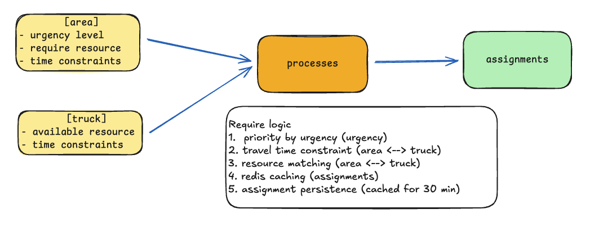
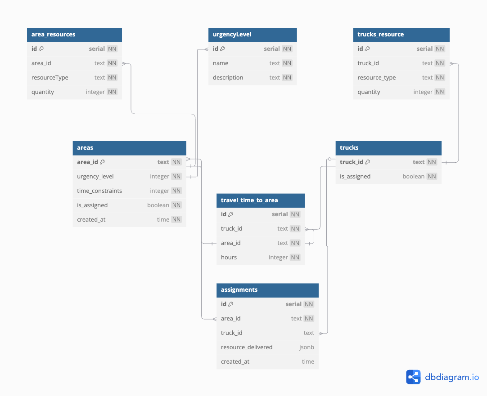
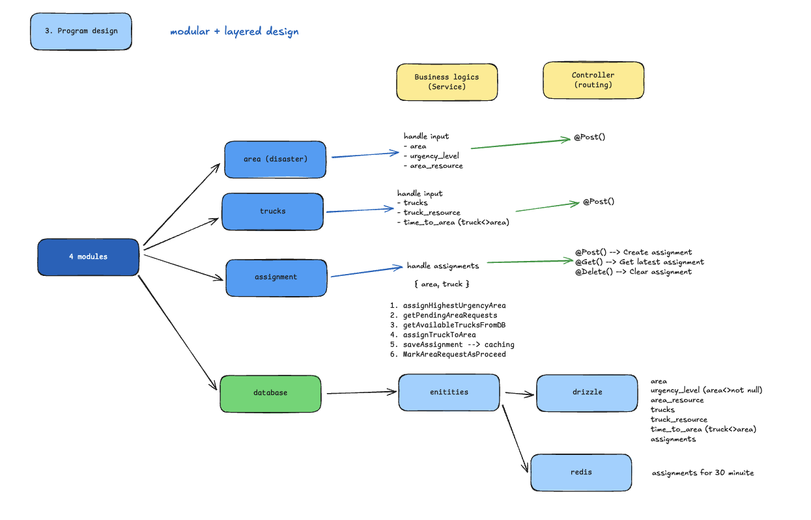

## Description

[Disaster Resource Allocation API](https://disaster-app-c0gudrgjgtgncfgv.southeastasia-01.azurewebsites.net/api#/) API using **Nestjs**

## Problems

- to allocate emergency resource to affected area after natural disaster
- areas with higher emergency and tighter constrains receive resource first

## Requirement

- adding affected area
- adding resource trucks
- processes truck assignment by resource matching (area <> truck)
- return last processed assignment (cached by Redis)

### Require Logics

- resource matching (area <> truck)
- travel time constraint (area, area <> truck)
- priority by urgency
- redis caching
- assignment persistence (cached by redis for 30 minutes)

## Summary Problems

In summary, we have an **_affected area_** with require resources {eg.food,water} need to transfer within their **_time constraints_** and **_the truck_** that provided resources for. Matching them with resource and time constraints as **_an assignment_** results by **_higher urgency_** priority.


_problem summary picture_

## What we gonna do ?

- How we created an input data ? (area,truck,resource) --> (json,dict format)
- How we matching between area, resource and truck by their constraints ? (area <> truck)
- How we caching a results ?
- How we documentation an API for client team and How we deploy an apps ?

## Project Design

how we design system --> Problem base driven design.<br />

1.  Platform design
2.  Database design
3.  Program design (Logics)

### 1. Platform design (Stacks)

**NestJS + Drizzle + Neon(_Serverless PostgreSQL_) + Redis** <br />

Why we use **NestJS** ?<br />

- **Typescript** support
- **Modular** architect
- **OOP** support
- Database integration (ORM support)
- Documentation (support **Swagger**)
- Auto reloading (built-in), we don't need **nodemon** anymore :D<br />

Why we selected **Drizzle** ?<br />

We can use as an ORM and Migration tools for database connection.<br />

- Typed SQL
- SQL Like
- Lightweight

Why we selected **Neon** ?<br />

- Free serverless PostgreSQL
- Easy for integrations
- Data type support (json)

### Summary tools for development

- Node.js Framework - **_NestJS_**
- Languages - **_Typescript_**
- Database integration - **_Drizzle_**
- Documentation - **_Swagger_**
- Caching - **_Redis by Keyv_**
- Testing - **_Postman_ , _DBeaver_**

### 2. Database design

1. **gathering requirements** - gather require from problems
2. **write nouns** - entities that need to be created
3. **design schema** - how we store a data in our storage



### 3. Program design (Logics)

We use a concept of modular and layered code, so we split a code into 2 group 4 module, 3 modules handle for business logics and 1 module stand for entities.

Business logics module

1. **area (disaster)** - handle for area input
2. **trucks** - handle for truck input
3. **assignment** - handle a process of an assignment including cached

Entities module

1. **database** - handle for all entities in our API



<!-- ## Run tests

```bash
# unit tests
$ npm run test

# e2e tests
$ npm run test:e2e

# test coverage
$ npm run test:cov
``` -->

## Deployment

Deployment on both Railway and Azure Cloud Registry

On Azure [Disaster Resource Allocation API](https://disaster-app-c0gudrgjgtgncfgv.southeastasia-01.azurewebsites.net/api#/)

1. Image - ACR
2. Database - Neon
3. Caching - Azure Cache for Redis
4. Deploying platform - Linux
5. Documenting - Swagger

On Railway [Disaster Resource Allocation API](https://disaster-api-nestjs-production.up.railway.app/api#/)

1. Docker Image - Github
2. Database - Neon
3. Redis - docker image on Railway
4. Documenting - Swagger

<!-- ## Resources

Check out a few resources that may come in handy when working with NestJS:

- Visit the [NestJS Documentation](https://docs.nestjs.com) to learn more about the framework.
- For questions and support, please visit our [Discord channel](https://discord.gg/G7Qnnhy).
- To dive deeper and get more hands-on experience, check out our official video [courses](https://courses.nestjs.com/).
- Deploy your application to AWS with the help of [NestJS Mau](https://mau.nestjs.com) in just a few clicks.
- Visualize your application graph and interact with the NestJS application in real-time using [NestJS Devtools](https://devtools.nestjs.com).
- Need help with your project (part-time to full-time)? Check out our official [enterprise support](https://enterprise.nestjs.com).
- To stay in the loop and get updates, follow us on [X](https://x.com/nestframework) and [LinkedIn](https://linkedin.com/company/nestjs).
- Looking for a job, or have a job to offer? Check out our official [Jobs board](https://jobs.nestjs.com).

## Support

Nest is an MIT-licensed open source project. It can grow thanks to the sponsors and support by the amazing backers. If you'd like to join them, please [read more here](https://docs.nestjs.com/support).

## Stay in touch

- Author - [Kamil Myśliwiec](https://twitter.com/kammysliwiec)
- Website - [https://nestjs.com](https://nestjs.com/)
- Twitter - [@nestframework](https://twitter.com/nestframework)

## License

Nest is [MIT licensed](https://github.com/nestjs/nest/blob/master/LICENSE). -->
